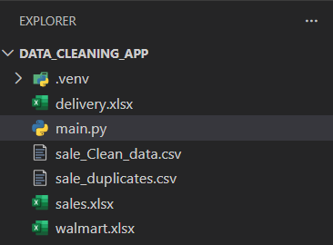
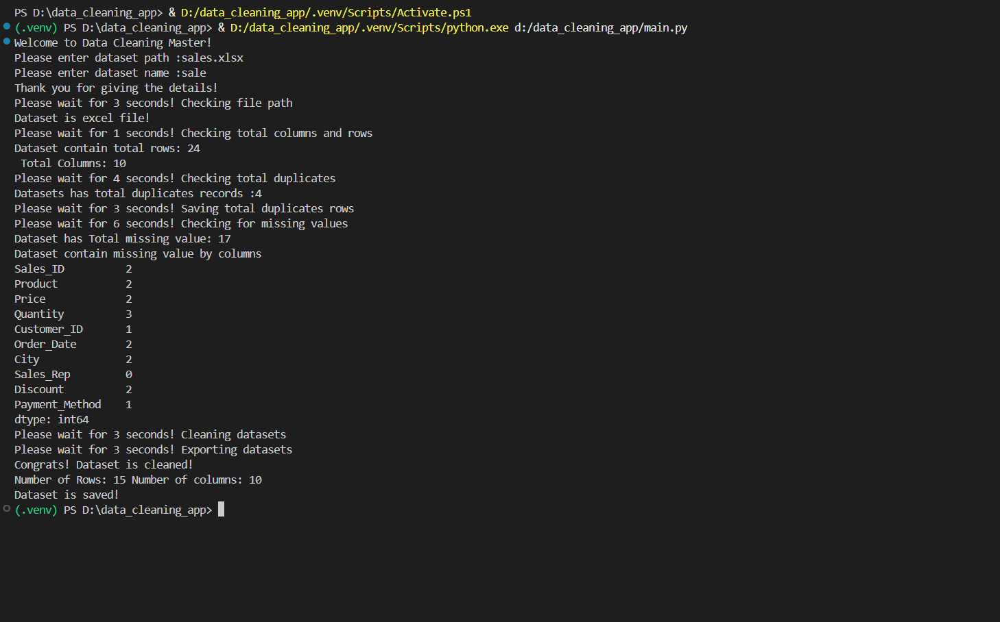

# python-data-cleaning-master
A Python-based data cleaning application that removes duplicates, handles missing values, and exports clean datasets efficiently for data analysis workflows.

---

## Data Cleaning Master - Python Application

## Project Overview

The **Data Cleaning Master** is a Python-based application built to automate the process of cleaning raw datasets. It helps users quickly identify and remove duplicate records, handle missing values intelligently, and export clean datasets for further analysis.

This application is designed for beginners and intermediate Python users who want a simple yet effective data-cleaning solution. It works efficiently even with large datasets and provides clear, step-by-step terminal feedback during execution.

---

## Objectives

The main objectives of this project are:

1. Load datasets in CSV and Excel formats.
2. Identify duplicate records and remove them from the dataset.
3. Save duplicate records separately for reference.
4. Handle missing values:
   - Replace missing values in numeric columns with the column mean.
   - Drop rows containing missing values in non-numeric columns.
5. Export the cleaned dataset for further analysis.

---

## Project Requirements

- Python 3.x
- Pandas
- NumPy
- Openpyxl
- Xlrd
- OS module
- Random module
- Jupyter Notebook (optional, for testing)

---

## Step-by-Step Process

### 1. User Input & File Validation
- The application asks the user to enter the dataset path and dataset name.
- It verifies whether the file path exists.
- It checks if the dataset format is supported (CSV or Excel).

---

### 2. Duplicate Detection
- The application scans the dataset for duplicate records.
- All duplicate rows are saved in a separate file named: {dataset_name}_duplicates.csv
- Duplicate rows are then removed from the dataset.

---

### 3. Missing Value Handling
- The application checks for missing values across all columns.
- Numeric columns:
  - Missing values are replaced with the column mean.
- Non-numeric columns:
  - Rows containing missing values are dropped.

---

### 4. Exporting Clean Dataset
- After cleaning, the dataset is saved as: {dataset_name}_Clean_data.csv
- A success message is displayed in the terminal.

---

### 5. Performance Testing
- The application has been tested on multiple datasets containing over **10,000 rows**.
- It successfully cleaned all datasets within seconds without errors.
- The script was also tested using **Jupyter Notebook** for interactive analysis.

---

## Key Features

- Fast and efficient data cleaning
- Automatic duplicate detection and backup
- Intelligent missing value handling
- User-friendly terminal prompts
- Supports CSV and Excel files
- Suitable for data analysis and preprocessing tasks

---

## Usage

1. Activate your Python virtual environment (if applicable).
2. Run the application from the terminal:

```bash
python main.py
```

3. Enter the dataset path and dataset name when prompted.


---

## Example Execution

```text
Welcome to Data Cleaning Master!
Please enter dataset path: D:\datasets\sales.xlsx
Please enter dataset name: sales
```

### Output Files

- `sales_duplicates.csv`
- `sales_Clean_data.csv`
---

## Final Notes

The Data Cleaning Master simplifies one of the most important steps in data analysis — cleaning raw data.
By automating repetitive cleaning tasks, it helps analysts and beginners focus more on insights rather than preprocessing.

## Credits

This project was created by learning from YT – Zero Analyst.
The application was built by following and practicing concepts explained in his YouTube tutorials.

Special thanks to Zero Analyst for the guidance and learning resources.

## Screenshots

### Project Folder Structure


---

### Terminal Execution Output



